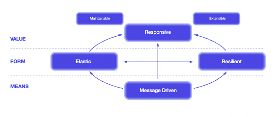

# 동기
- 코틀린 문법책만 봐서는 빨리 못 배울거 같고 약간 지루해져서 일단 구현을 좀 해보고 싶음
  
  코틀린으로 웹 개발 해보기

  더불어 리액티브 학습, 구현 해보기

# 큰 그림
- [리액티브 선언문](https://www.reactivemanifesto.org/)
  - responsive
  - resilient?
  - elastic
  - message driven?
  
  

- 리액티브 프로그래밍 모델 장점
  - 인프라 자원을 더 효율적으로 사용 가능하다고 함..
  - 빠르고 non blocking

- 클라우드
  - microsevices의 배포,관리,확장을 책임
  - 클라우드에서 서비스를 쉽게 생성, 제거할 수 있어야 해서 컨테이너화한 어플리케이션을 많이 사용

# 생각들
- 클라우드 네이티브한 애플리케이션이 어떤건지 모르겠음
- MSA에서는 Thymeleaf가 필요없는 이유는?
- 애플리케이션을 패키징한다는게 정확히 뭔지
  - [geeksforgeeks / jar file 설명](https://www.geeksforgeeks.org/jar-files-java/)

# 참고 자료 
- Hands on Microservices With Kotlin (에이콘 출판)